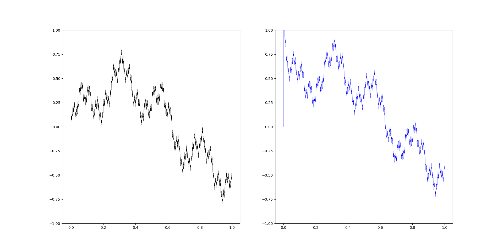

# special-curve-fitting

1. Weierstass
   
2. Fourier

## TODO

1. add `numba` to speed up python scripts

2. boundary problem, see img below

3. how to be faster

## digression

> For the Science Citation Index ! —— f1974939505、AllBlue-dulan
> 
> 国家レベルのストローク選手 —— hhhfccz
